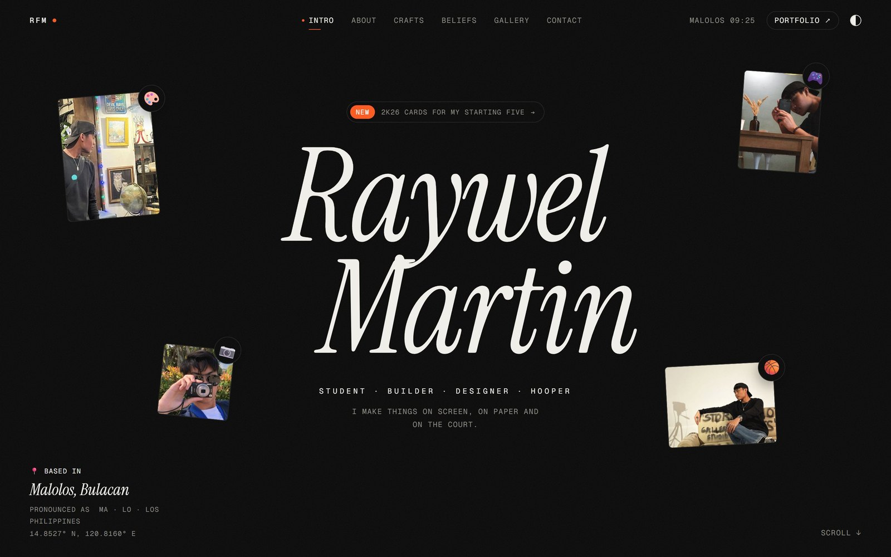
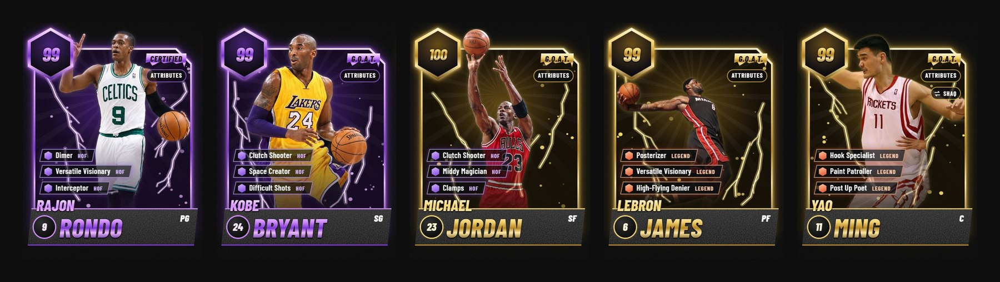

# Raywel Martin — off the clock

### 🔗 [matimbu.github.io/raywelfrancismartin](https://matimbu.github.io/raywelfrancismartin/)



Share it with friends (hit the copy button on the right):

```
https://matimbu.github.io/raywelfrancismartin/
```

My personal site: the things I make, what I do for fun, what I believe in, and where to find me. My developer portfolio lives at [matimbu.github.io/portfolio](https://matimbu.github.io/portfolio/).

Built with plain HTML, CSS and JavaScript, plus [Lenis](https://github.com/darkroomengineering/lenis) for smooth scrolling. No framework, no build step.

## Links worth sharing

| Link | Opens |
| --- | --- |
| [matimbu.github.io/raywelfrancismartin](https://matimbu.github.io/raywelfrancismartin/) | The site |
| [matimbu.github.io/raywelfrancismartin/watch/](https://matimbu.github.io/raywelfrancismartin/watch/) | Straight to my videos, with its own preview card |
| [matimbu.github.io/raywelfrancismartin/airball](https://matimbu.github.io/raywelfrancismartin/airball) | Airball, the basketball game on the 404 page (any address that doesn't exist opens it) |

## What's on it

- **Intro**: my name with four of my photos around it, what I do, and where I'm based, with a small **New** pill over my name for what's just been added. The first visit in a session opens on an "RM." curtain.
- **01 About**: who I am, what I'm up to right now, the names people call me, and the story so far, from the pandemic days to Malolos Rush.
- **02 Crafts**: things I've made, from my memory videos and the Cheesy Potato Balls poster to The Hive Kiosk and Malolos Rush. Hover a row for a preview.
- **03 Off the clock**: my hobbies; my IM BUSY playlist and current pick, spinning on a record; how I play (On the court, drawn on a coach's board); my all-time starting five as NBA 2K26 MyTEAM cards; and Sova, the agent I main.
- **04 What I believe**: the things I live by, and my motto: focus on what I can control.
- **05 Watch Me**: my YouTube and TikTok clips, opening on a fan of their covers.
- **06 Snapshots**: photos I kept, each with a caption and a story, in a full-screen viewer.
- **07 Contact**: email, Instagram, YouTube, TikTok, GitHub, LinkedIn, Discord and my Valorant ID.

## Things to try



- Hover a starting-five photo (tap it on a phone) to turn it into its 2K card. The first time, the cards open like a pack, walkouts and all; **Open the pack again** replays it. The tab on a card switches its badges and its attributes (the whole build, like 2K26's upgrade screen), and the switch on Yao's card brings Shaq in front. The biggest pulls bring the crowd up.
- Move the mouse around a turned card (or tilt your phone) and its layers come apart like a holo card.
- Click **Sova**, then **LOCK IN**.
- With Sova's wall on screen, press **Q**, **E**, **C** and **X** for his abilities, like in the game. Hunter's Fury needs its ult points first.
- Type **sova** anywhere to launch the Owl Drone.
- Click **LOCKED IN** under Sova's picture. It knows his real name.
- **Take a shot** from the Basketball card: hold, release in the green, drag the ball back for a longer shot, and share your streak.
- Flip between dark and light with the toggle at the top right.

## Editing

Everything the site says is in `content.js`, grouped by section (`about`, `walls`, `story`, `crafts`, `hobbies`, `playlist`, `beliefs`, `youtube`, `gallery`, `links`). The comments in it explain each option. When something new goes up, add a line to `recent` so the New pill shows it.

After changing `content.js`, `main.js` or `style.css`, bump the `?v=` number on them in `index.html` so returning visitors don't get old cached copies (GitHub Pages caches files for 10 minutes). For the same reason, a replaced picture gets a new file name instead of overwriting the old one. Entries containing `TODO` show up (outlined in yellow) only when previewing locally; the live site skips them.

To publish, commit and push to `main`. GitHub Pages redeploys in about a minute.

## Pages

- `index.html` is the site.
- `404.html` is Airball, the page GitHub Pages shows for any address that doesn't exist.
- `watch/index.html` is a share page for the videos. It has its own preview card (`assets/og-watch.jpg`) and sends people on to Watch Me.

## Photos and other files

- `images/` holds original, full-size photos. It's in `.gitignore`, so originals are never published.
- `assets/` holds the web-ready copies the site uses: rule-of-thirds crops, lightly colour-graded, resized and stripped of metadata (no GPS). They're exported once, straight from the originals, as JPEG quality 97 with full colour detail (4:4:4); at top quality JPEG keeps more detail than lossy WebP, and PNG/BMP would be 3–25× heavier.
- `assets/gallery/` holds the Snapshots gallery: each photo at 400, 800 and 1600 px (the page loads the small ones in the grid and the 1600 px one only when a photo is opened). Captions and order live in `gallery` in `content.js`.
- Edited a photo in Lightroom? Export a full-size JPEG into `images/` and re-crop it, or export straight to the matching file in `assets/` at the same size (`me-shop.jpg` 480×640, `me-cafe.jpg` 480×600, `me-camera.jpg` 480×480, `me-sofa.jpg` 640×480).
- `assets/aka/` holds the photos on the Also known as wall.
- `assets/five/` holds the starting-five photos (480×640), and mine for my own card (off the page for now). `assets/five/cut/` holds the players (and me) cut out for the 2K cards: 600×800 transparent WebP in the card's shape, framed so a head, a hand or the ball breaks over the card's top edge (`cut` in `content.js`).
- `assets/youtube/` and `assets/tiktok/` hold the designed video covers (720×1280, plus light `-480` copies for the Watch Me fan). The full-size 1080×1920 covers are in `exports/`. TikTok's own thumbnail links expire, so each TikTok clip also keeps its original thumbnail here, named after its video ID.
- `assets/valorant/` holds Sova's art, icon and ability icons (from [valorant-api.com](https://valorant-api.com)). Riot's fan-content notice has to stay under the Agents I main wall while they're used.
- `assets/audio/` holds the Sova sounds. Every sound on the main page plays through one mixer that evens out their volume, and the Sound switch on Sova's wall mutes them all (Airball has its own switch). The click, whoosh and 2K pack sounds are made in code, so they have no files.
- `assets/og-image.jpg` (1200×630) is the picture people see when the link is shared in Messenger, Discord, Facebook or X. To change it, replace the file at the same size. Apps cache previews, so to refresh one after a change, paste the link into [Facebook's Sharing Debugger](https://developers.facebook.com/tools/debug/) and press "Scrape Again".
- `assets/readme/` holds the pictures in this README.
- `assets/icons/` holds the "RM." tab icon (16 and 32 px, drawn slightly bolder so it stays readable), a 192 px icon and `apple-touch-icon.png` for phone home screens.

## Visitor stats

Visits are counted with [GoatCounter](https://matimbu.goatcounter.com), which uses no cookies. To stop counting your own visits, open the site once with `#toggle-goatcounter` at the end of the address, in each browser you use. Local previews are never counted.

## Kept off GitHub

These folders stay on my PC (they're in `.gitignore`): `images/` (original photos), `videos/` (original clips), `audios/` (original sound files), `exports/` (images for socials, like story slides and full-size covers), `screenshots/` (captures from building the site; `screenshots/INDEX.md` explains them), `plans/` (animation audit plans) and `.claude/` (design skills).

## Credits

- The Yao Ming photos are from Wikimedia Commons under Creative Commons licences, credited under their walls on the site. Their crops and cut-outs here are shared under the same licences.
- The Rondo, Kobe, MJ, LeBron, Shaq and Wemby photos belong to their photographers.
- Sova's art and icons belong to Riot Games and are used under Riot's fan-content policy.
- The 2K cards are fan-made, in the style of NBA 2K26's MyTEAM cards.
- Fonts: Instrument Serif, Geist, Geist Mono and Barlow Condensed, from Google Fonts. Videos and music play in YouTube's, TikTok's and Spotify's own players.

## Preview locally

```bash
python -m http.server 5500
```

Then open http://localhost:5500.
